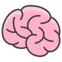

## Mindful

Mindful keeps you from accessing websites more frequently than you want. It helps reduce the anxiety and compulsive
behavior. Keeping you at peace.

## See it in action

## How does it work?

- User selects the time they want to be _mindful_ for
- Mindful will remember their preference and next time they visit the same website
    - If `currentTime < (lastVisited + setFrequency)`: close the tab
    - Else update the `lastVisited` to `Date.now()`